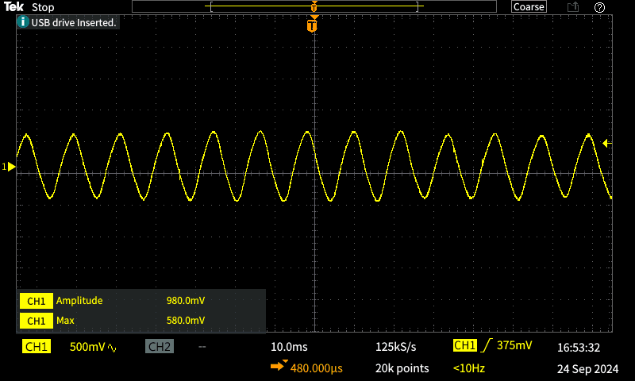

## 24 Settembre 2024

- Chip: gradual good
- corrente clk off: 17 mA (poi 20 nel pome)
- corrente clk on: 48 mA
- probe 10x accoppiamento DC
- clk amplitude sulla pcb della FPGA: circa 1 V (preciso 1.040 V) picco picco
- clk amplitude sulla pcb della FPGA: circa 2 V (preciso 1.85 V) picco picco
- Osc usato con limitr a 50 MHz

- clk_N on su PCB FPGA:   
-  clk_N on su piazzola differenziale vicino al tab bond: 
- clk_P on su PCB FPGA:  
- clk_P on su piazzola differenziale vicino al tab:  
- clk_N on su PCB FPGA con Osc 100 MHz zoom:  
- clk_N on su PCB FPGA con Osc 100 MHz:  
- Nota: bisogna mettere il ground vicino a dove si fa la misura, se aggiungi un lungo ground la misura si rovina. Bisogna quindi mettere un ground vicino al punto di misura. Ecco perchè si mette la via delle differenziali col GND a fianco alle differenziali. 
- Nota: il segnale che esce dal dispositivo circuito integrato è più lento, viene infatti smussato. E diventa una onda triangolare praticamente. 
- clk_N on su piazzola differenziale vicino al tab FPGA con Osc 100 MHz 
- immagine 2 e 3 nel rigol.
- Setup nuovo con calamite di Evgeny molto utile e punte da 200 Mhz. 
- Attenzione che Ev dice che una volta che connettiamo tutto il segnale è tutto insieme, non dipende da dove lo misuri, la linea è una cosa unica. Quindi bisogna fare le misure con: solo FPGA, FPGA+PCB verde, FPGA + PCB verde + flex.
